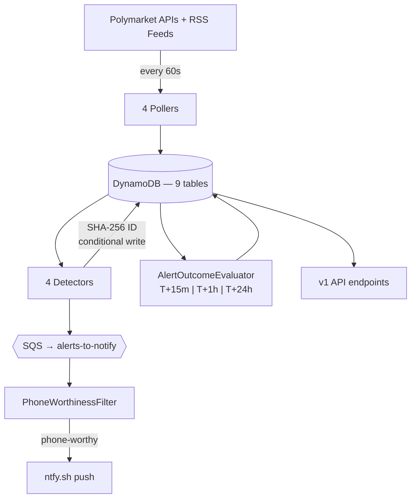

# PolySign

PolySign is an anomaly-detection and signal-quality system for Polymarket prediction markets. It polls 400 markets every 60 seconds, runs four independent detectors against the price and trade stream, and surfaces convergence events through a cursor-paginated REST API and push notifications. The non-obvious part: every alert is scored at T+15m, T+1h, and T+24h against the actual forward price movement, and the measured precision feeds back into the notification filter. A signal system that cannot report its own accuracy is indistinguishable from noise. [polysign.dev](https://polysign.dev)

## What it does

Four pollers ingest data from Polymarket's Gamma, CLOB, and Data APIs plus five RSS feeds every 60 seconds. Four detectors evaluate the stream each cycle: `PriceMovementDetector` catches absolute threshold breaches (>= 8% in a 15-minute window), `StatisticalAnomalyDetector` flags z-score spikes above 3 sigma relative to each market's recent behavior, `WalletActivityDetector` with `ConsensusDetector` identifies tracked-wallet convergence (3+ wallets taking the same position within 30 minutes), and `NewsCorrelationDetector` matches breaking articles to markets by keyword overlap. When 2+ detectors fire on the same market within 60 minutes, that convergence is the signal.

Each alert is enqueued to SQS and consumed by `NotificationConsumer`, which runs it through `PhoneWorthinessFilter` — a three-rule gate that passes consensus events, multi-detector convergence, and precision-gated criticals. Alerts failing all three still land in DynamoDB and the dashboard. They just do not ring the phone.

`AlertOutcomeEvaluator` runs every 5 minutes, finds alerts whose next evaluation horizon is due, looks up the price snapshot at that offset, and writes a directional-correctness result to `alert_outcomes`. `SignalPerformanceService` aggregates per-detector precision at each horizon. A detector whose 1-hour precision drops below threshold stops generating phone alerts automatically. The feedback loop is closed — detection to scoring to gating, no manual intervention.

## Architecture



Java 25, Spring Boot 3.5.5, single Maven module. Nine DynamoDB tables with on-demand capacity (`markets`, `price_snapshots`, `articles`, `market_news_matches`, `watched_wallets`, `wallet_trades`, `alerts`, `alert_outcomes`, `api_keys`). Three SQS queues (`news-to-process`, `wallet-trades-to-process`, `alerts-to-notify`), each with a dead-letter queue (max 5 receives). S3 (`polysign-archives`) for daily snapshot rollups. Runs on a single EC2 `t3.small` in `us-east-2`, fronted by Caddy for TLS.

Alert IDs are deterministic: `SHA-256(type | marketId | bucketedTimestamp | payloadHash)`. Every write uses DynamoDB `attribute_not_exists(alertId)` on the composite key — duplicates are rejected at the storage layer with no external dedup table. Resilience4j 2.2.0 wraps every outbound HTTP call: six circuit breaker instances (`polymarket-gamma`, `polymarket-clob`, `polymarket-data`, `ntfy`, `claude-api`, `rss-news`), five retry policies with exponential backoff, one rate limiter (CLOB at 10 calls/sec). All table access goes through DynamoDB Enhanced Client (AWS SDK v2).

## Developer API

All `/api/v1/**` endpoints require an `X-API-Key` header. Raw keys are SHA-256 hashed at rest — shown once at creation, never stored. The `api_keys` table holds only the hash as the partition key.

| Tier | Limit | On exceed |
|---|---|---|
| `FREE` | 60 req/min | 429 + `Retry-After` header |
| `PRO` | 600 req/min | 429 + `Retry-After` header |

Rate limiting is per-key via Resilience4j. Every authenticated response includes `X-RateLimit-Limit`, `X-RateLimit-Remaining`, and `X-RateLimit-Reset`.

Endpoints:

- `GET /api/v1/alerts` — paginated alerts, filterable by `marketId`, `type`, `minSeverity`, `since`
- `GET /api/v1/snapshots` — price history (`marketId` required)
- `GET /api/v1/signals/performance` — per-detector precision and sample counts by horizon
- `GET /api/v1/markets` — active tracked markets, filterable by `category` and `minVolume`

All list endpoints use cursor pagination. Cursors are opaque base64url-encoded DynamoDB `LastEvaluatedKey` values. A malformed cursor returns 400.

```bash
curl -s -H "X-API-Key: psk_your_key" "https://polysign.dev/api/v1/alerts?limit=10"
# pass the returned cursor to get the next page
curl -s -H "X-API-Key: psk_your_key" "https://polysign.dev/api/v1/alerts?limit=10&cursor=eyJTIjoiY..."
```

Interactive docs at [`/api/docs/ui`](https://polysign.dev/api/docs/ui).

## Running locally

Prerequisites: Java 25, Maven, Docker.

For offline development without an AWS account, use the LocalStack override:

```bash
git clone https://github.com/leonardholler/polysign.git
cd polysign
docker compose -f docker-compose.yml -f docker-compose.local.yml up --build
```

Wait ~90 seconds for LocalStack to bootstrap tables and queues. The dashboard is served at `http://localhost:8080`. The first cycle takes a few minutes — `MarketPoller` paginates Polymarket's 50,000+ markets, applies quality filters (volume floors, time-to-expiry, 24h activity), and keeps the top 400 by 24h volume. After that, everything runs every 60 seconds.

Without Docker:

```bash
mvn spring-boot:run -Dspring-boot.run.profiles=local
```

On first boot, `ApiKeyBootstrap` creates a `FREE`-tier demo key and logs it at `INFO`:

```
event=demo_api_key_created clientName=demo-client rawKey=psk_XXXX...
```

Save it. It cannot be recovered. Use it to hit the API:

```bash
curl -H "X-API-Key: psk_XXXX..." http://localhost:8080/api/v1/alerts
```

## Testing

234 tests. JUnit 5 + Mockito + AssertJ for unit tests (`mvn test`), Testcontainers with LocalStack 3.8 for integration tests (`mvn verify`). Split via Maven Surefire (unit) and Failsafe (integration).

`PublicApiIT` covers the auth and pagination contract end-to-end against LocalStack: 401 on missing key, 401 on invalid key, 200 on valid key, cursor pagination roundtrip with no-overlap verification, and rate-limit enforcement (65 burst requests producing at least one 429 with correct `Retry-After` and `X-RateLimit-*` headers).

## Design notes

See [DESIGN.md](DESIGN.md) for the full treatment: data model with access-pattern rationale for all 9 tables, write path trace from poll to phone, alert ID design and the composite-key bug, SQS consumer pattern, Resilience4j strategy across all 6 call sites, failure mode matrix, and signal quality methodology (precision definition, dead zone, horizon vs. resolution evaluation, known biases).

`NewsCorrelationDetector` is feature-flagged off (`polysign.detectors.news.enabled: false`) pending rewrite from keyword-overlap matching to embedding-based semantic similarity.
