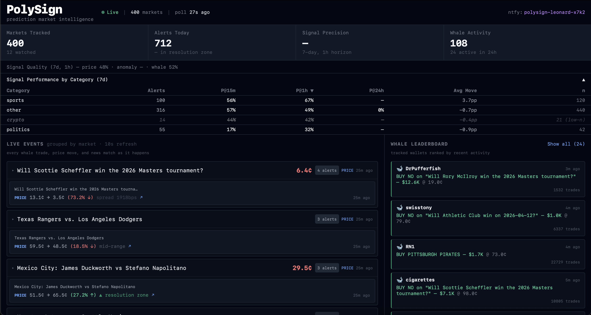
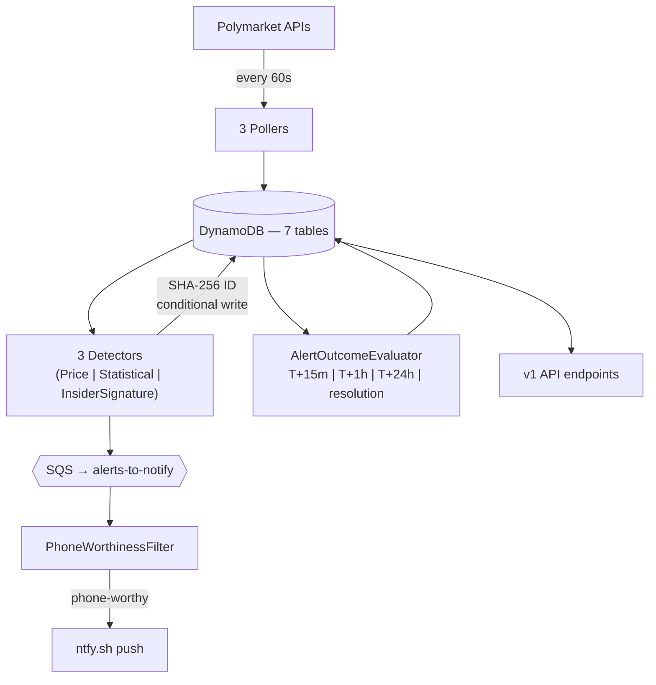

# PolySign

PolySign is an anomaly-detection and signal-quality system for Polymarket prediction markets. It polls ~400 markets every 60 seconds, runs three independent detectors against the price and trade stream, and surfaces alerts through a cursor-paginated REST API and push notifications. The non-obvious part: every alert is scored at T+15m, T+1h, T+24h, and at market resolution against the actual forward price movement, and the measured precision feeds back into the notification filter. A signal system that cannot report its own accuracy is indistinguishable from noise.



## What it does

Three pollers ingest data from Polymarket's Gamma, CLOB, and Data APIs every 60 seconds. Three detectors evaluate the stream each cycle:

- **PriceMovementDetector** — catches threshold breaches within any 15-minute window. Tier 1 (volume > $250k): 8% threshold. Tier 2 ($50k–$250k): 14%. Tier 3 (< $50k): 20%. No hard volume floor — all markets are in scope. Tier 2/3 alerts require an orderbook depth gate (spread ≤ 500 bps, depth-at-mid ≥ $100 USDC) before firing.
- **StatisticalAnomalyDetector** — z-scores the most recent absolute return against the last 60 minutes of snapshots. Fires when |z| exceeds the tier threshold: 3.0 for Tier 1, 4.0 for Tier 2, 5.0 for Tier 3. Requires ≥ 20 snapshots in the lookback window.
- **InsiderSignatureDetector** — scans the live trade stream for burner-wallet activity on high-volume markets (see below).

Three detectors removed during Phase 20: `WalletActivityDetector` (replaced by market-driven `InsiderSignatureDetector`), `ConsensusDetector`, and `NewsCorrelationDetector`.

Each alert is enqueued to SQS and consumed by `NotificationConsumer`, which runs it through `PhoneWorthinessFilter` — a six-condition gate (first match wins):

1. Consensus alerts auto-pass (consensus type removed but rule retained)
2. Multi-detector convergence: ≥ 2 distinct detector types fired on the same market in the last 15 minutes
3. `insider_signature` alerts auto-pass — low base rate, high conviction
4. `severity=critical` + trailing 7-day T+1h precision ≥ 60% (fails closed when no data yet)
5. `wallet_activity` trades ≥ $10K — bypass precision gate while backtest data accumulates
6. `price_movement` entering a resolution zone (ENTERED_BULLISH or ENTERED_BEARISH transition)

Alerts failing all rules still land in DynamoDB and the dashboard. They do not ring the phone.

`AlertOutcomeEvaluator` runs every 5 minutes on a cron, finds alerts whose next evaluation horizon is due, looks up the price snapshot at that offset, and writes a directional-correctness result to `alert_outcomes`. Horizons: T+15m, T+1h, T+24h. `ResolutionSweeper` adds a fourth horizon — `resolution` — by polling the Gamma API for closed markets every 2 minutes and scoring each alert against the final market price. `SignalPerformanceService` aggregates per-detector precision at each horizon. The feedback loop is closed — detection to scoring to gating, no manual intervention.

## InsiderSignatureDetector

The simpler design was a static watched-wallet list. That approach fails for Polymarket specifically because documented insider cases (Feb 28 2026 US-Iran strike, April 7 ceasefire, Maduro capture bets) all used fresh burner wallets that go dormant after one trade. A list of known insiders is a list of wallets that will never trade again.

The detector implements a real-time simplified version of the screen described in Mitts & Ofir, "From Iran to Taylor Swift: Informed Trading in Prediction Markets" (Columbia Law / Harvard CorpGov, 2026), which systematically identified the same burner-wallet signature across 93,000 Polymarket markets. An alert fires when all of the following hold:

- Market 24h volume ≥ $100k and not effectively resolved
- Market probability between 1% and 99%
- Trade is a BUY (not a SELL hedge)
- Trade occurred within the last 24h
- Trade size ≥ max($1,000, 0.5% of market volume)
- Wallet qualifies as a "burner": age ≤ 7 days, OR lifetime trades ≤ 5, OR this trade ≥ 70% of wallet lifetime volume
- No opposing-side bet by the same wallet in the last 2 hours

Cooldown: one alert per (wallet, market) pair per 24 hours. Per-wallet age, trade count, and lifetime volume are cached in the `wallet_metadata` table with a 6-hour TTL.

## Architecture



Java 25, Spring Boot 3.5.5, single Maven module. Seven DynamoDB tables with on-demand capacity (`markets`, `price_snapshots`, `wallet_trades`, `wallet_metadata`, `alerts`, `alert_outcomes`, `api_keys`). Two SQS queues (`wallet-trades-to-process`, `alerts-to-notify`), each with a dead-letter queue (max 5 receives). S3 (`polysign-archives`) for daily snapshot rollups. Runs on a single EC2 `t3.small` in `us-east-2`, fronted by Caddy for TLS.

Alert IDs are deterministic: `SHA-256(type | marketId | bucketedTimestamp | payloadHash)`. Every write uses DynamoDB `attribute_not_exists(alertId)` on the composite key — duplicates are rejected at the storage layer with no external dedup table. Resilience4j 2.2.0 wraps every outbound HTTP call: four circuit breaker instances (`polymarket-gamma`, `polymarket-clob`, `polymarket-data`, `ntfy`), five retry policies with exponential backoff, one rate limiter (CLOB at 10 calls/sec). All table access goes through DynamoDB Enhanced Client (AWS SDK v2).

## Dashboard

Served at `:8080`. Two panels:

- **Live Events** — active alerts with detector type, severity, price-at-alert, and a Polymarket link
- **Recent Resolutions** — resolved alert outcomes showing the pre-move price at alert time, the resolution price, and whether the direction prediction was correct

Removed panels: Watched Markets (removed with Phase 1 wallet rebuild), Whale Leaderboard (removed with the WalletActivityDetector refactor).

## Developer API

All `/api/v1/**` endpoints require an `X-API-Key` header. Raw keys are SHA-256 hashed at rest — shown once at creation, never stored.

| Tier | Limit | On exceed |
|---|---|---|
| `FREE` | 60 req/min | 429 + `Retry-After` header |
| `PRO` | 600 req/min | 429 + `Retry-After` header |

Rate limiting is per-key via Resilience4j. Every authenticated response includes `X-RateLimit-Limit`, `X-RateLimit-Remaining`, and `X-RateLimit-Reset`.

Endpoints:

- `GET /api/v1/alerts` — paginated alerts, filterable by `marketId`, `type`, `minSeverity`, `since`
- `GET /api/v1/snapshots` — price history (`marketId` required)
- `GET /api/v1/signals/performance` — per-detector precision and sample counts by horizon
- `GET /api/v1/markets` — active tracked markets, filterable by `category` and `minVolume`

All list endpoints use cursor pagination. Cursors are opaque base64url-encoded DynamoDB `LastEvaluatedKey` values. A malformed cursor returns 400.

```bash
curl -s -H "X-API-Key: psk_your_key" "https://polysign.dev/api/v1/alerts?limit=10"
curl -s -H "X-API-Key: psk_your_key" "https://polysign.dev/api/v1/alerts?limit=10&cursor=eyJTIjoiY..."
```

Interactive docs at [`/api/docs/ui`](https://polysign.dev/api/docs/ui).

## Running locally

Prerequisites: Java 25, Maven, Docker.

```bash
git clone https://github.com/leonardholler/polysign.git
cd polysign
docker compose up --build
```

Wait ~90 seconds for LocalStack to bootstrap tables and queues. The dashboard is served at `http://localhost:8080`. The first cycle takes a few minutes — `MarketPoller` paginates Polymarket's 50,000+ markets, applies quality filters (volume floors, time-to-expiry, 24h activity), and keeps the top ~400 by 24h volume. After that, everything runs every 60 seconds.

Without Docker:

```bash
mvn spring-boot:run -Dspring-boot.run.profiles=local
```

On first boot, `ApiKeyBootstrap` creates a `FREE`-tier demo key and logs it at `INFO`:

```
event=demo_api_key_created clientName=demo-client rawKey=psk_XXXX...
```

Save it. It cannot be recovered. Use it to hit the API:

```bash
curl -H "X-API-Key: psk_XXXX..." http://localhost:8080/api/v1/alerts
```

## Testing

291 unit tests, 12 integration tests. JUnit 5 + Mockito + AssertJ for unit tests (`mvn test`), Testcontainers with LocalStack 3.8 for integration tests (`mvn verify`). Split via Maven Surefire (unit) and Failsafe (integration).

`GoldenPathIT` proves the complete signal quality loop end-to-end: price movement detection → DynamoDB persist → SQS enqueue → idempotency → `AlertOutcomeEvaluator` scoring at T+15m. Mutation test: comment out `alertService.tryCreate(...)` in the detector and this test goes red. `PublicApiIT` covers the auth and pagination contract: 401 on missing/invalid key, 200 on valid key, cursor pagination with no-overlap verification, rate-limit enforcement (65 burst requests producing at least one 429 with correct headers).

## Design notes

See [DESIGN.md](DESIGN.md) for the full treatment: data model with access-pattern rationale for all 7 tables, write path trace from poll to phone, alert ID design and the composite-key bug, SQS consumer pattern, Resilience4j strategy across all 4 circuit breakers, failure mode matrix, observed signal quality results, and signal quality methodology (precision definition, dead zone, horizon vs. resolution evaluation, known biases).
