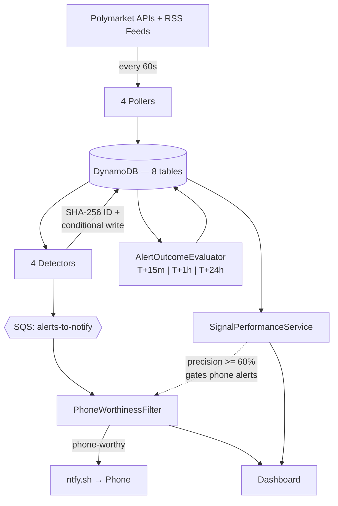

# PolySign

<!--  -->

> **Live demo**: https://polysign.dev

PolySign is a real-time event-processing and anomaly-detection system for Polymarket prediction markets. It polls 400+ active markets every 60 seconds, runs four independent detectors (price threshold, statistical anomaly, whale wallet consensus, news correlation), and pushes alerts to my phone when high-signal events occur. Then it scores every alert against forward price movement — at T+15 minutes, T+1 hour, and T+24 hours — to measure whether its own signals actually work.

The backtesting pipeline is the point. A monitoring system that can't report its own precision is indistinguishable from a random number generator with nice UI.

**This is a read-only monitoring tool. It does not place trades, hold funds, or have write access to any wallet.**

---

## Architecture



**Write path**: Polymarket Gamma API → `MarketPoller` → `markets` table → `PricePoller` → `price_snapshots` → `PriceMovementDetector` → `SHA-256(type|marketId|bucketedTimestamp)` → `alerts` (conditional write, reject on duplicate) → SQS → `PhoneWorthinessFilter` → ntfy.sh. Every hop carries a `correlationId` — one grep traces a single event through the entire pipeline.

**Feedback loop**: `AlertOutcomeEvaluator` runs every 5 minutes, finds alerts whose next horizon is due, looks up the price snapshot at `firedAt + horizon`, computes whether the predicted direction matched, and writes to `alert_outcomes`. `SignalPerformanceService` aggregates these into per-detector precision. The `PhoneWorthinessFilter` reads that precision to gate notifications. The dashboard shows the numbers above the fold.

---

## Signal Quality

Precision numbers are measured against live data via the backtesting pipeline. Each alert is scored at T+15m, T+1h, and T+24h against the actual forward price movement. Results are visible on the dashboard's Signal Quality panel after the system has been running long enough to accumulate a meaningful sample.

Precision = correct / (correct + wrong), excluding flat cases where |delta| < 0.5 percentage points. See [DESIGN.md](DESIGN.md#signal-quality-methodology) for methodology and known biases.

---

## Engineering Decisions

These are the decisions I'd walk through in an interview. Each one has an alternative I considered and a reason I didn't take it.

### Idempotency — the hardest bug I hit

Alert IDs are deterministic: `SHA-256(type | marketId | bucketedTimestamp | payloadHash)`. Every alert write uses DynamoDB's `attribute_not_exists(alertId)` condition. Duplicates get rejected silently — logged at `DEBUG`, swallowed, cost nothing.

The bug I hit: the `alerts` table has a composite key (PK=`alertId`, SK=`createdAt`). My first implementation set `createdAt = clock.now()`. Each poll cycle produced a slightly different `createdAt`, which targeted a different (PK, SK) slot — the condition checked a slot that didn't exist yet, so it always succeeded. Duplicate alerts everywhere.

The fix: `createdAt` comes from `AlertIdFactory.bucketedInstant()`, not the wall clock. Same inputs produce the same `alertId` and the same `createdAt`, which target the same DynamoDB slot. The condition rejects the second write.

Proof (run on live data, market `test-idem-001`):

| Step | Alert count | SQS depth | Log event |
|---|---|---|---|
| Before detector | 0 | 0 | — |
| After 1st run | 1 | 1 | `alert_created alertId=845f165c...` |
| After 2nd run | 1 | 1 | `alert_already_exists alertId=845f165c...` |
| After 3rd run | 1 | 1 | `alert_already_exists alertId=845f165c...` |

The alternative was `UUID.randomUUID()`. Simpler, and fine for systems where duplicates are tolerable. But this system sends phone notifications. A duplicate alert means my phone buzzes twice for the same event. Deterministic IDs are the only way to get exactly-once semantics without a separate dedup table or distributed lock.

### Resilience

Every outbound HTTP call goes through Resilience4j. Six circuit breaker instances (`polymarket-gamma`, `polymarket-clob`, `polymarket-data`, `ntfy`, `rss-news`), five retry policies with exponential backoff, one rate limiter (CLOB at 10 calls/sec). No naked `WebClient` calls in the codebase.

One intentional exception: `RssPoller` uses `java.net.http.HttpClient` instead of WebClient because Rome's `SyndFeedInput` requires a blocking `InputStream`. Still wrapped in the `rss-news` circuit breaker and retry — just not reactive.

A failed poll for one market or one wallet never crashes the scheduler. Catch at the per-item level, log with `correlationId`, increment `polysign.poll.failures`, continue.

Three SQS queues, each with a dead-letter queue (max 5 receives). Poison messages land in the DLQ instead of blocking the pipeline. DLQ depth is a Micrometer gauge — if it leaves zero, something is broken.

### Signal quality tuning — the 0.004 problem

Early in development, a market trading at 0.0045 fired a "22% price movement" alert when it ticked to 0.0055. Technically correct: `(0.0055 - 0.0045) / 0.0045 = 22.2%`. Completely useless — a 1-basis-point probability shift on a 99.5%-likely market carries zero trading signal. But the percentage threshold doesn't know that.

Two filters fixed this:

1. **Minimum absolute delta**: `|toPrice - fromPrice| >= 0.03`. The 0.0045 → 0.0055 move has a delta of 0.001 — way below the floor. A meaningful probability shift has to move the needle by at least 3 percentage points.

2. **Extreme-zone filter**: skip if both prices are below 0.05 or above 0.95. Markets in the tails routinely produce huge percentage swings from tiny absolute moves.

Before: hundreds of alerts per minute, mostly tail-zone noise. After: ~5 alerts/minute on moves with real probability substance.

This wasn't clever engineering. It was product judgment — asking "is this alert actually worth sending to a phone?" instead of implementing the spec literally.

### Observability

14 custom Micrometer metrics at `/actuator/prometheus`:

| Metric | Type | What it tells you |
|---|---|---|
| `polysign.markets.tracked` | gauge | Markets that passed filtering |
| `polysign.prices.polled` | counter | Price poll throughput and error rate |
| `polysign.alerts.fired` | counter | Alert volume by type and severity |
| `polysign.alerts.deduplicated` | counter | Idempotency is working (grows steadily) |
| `polysign.sqs.queue.depth` | gauge | Backpressure on each queue |
| `polysign.dlq.depth` | gauge | Poison messages (should be 0) |
| `polysign.signals.precision` | gauge | Per-detector, per-horizon precision |
| `polysign.signals.magnitude.mean` | gauge | Average move size after alert |
| `polysign.signals.sample.count` | gauge | Sample size behind each precision number |
| `polysign.outcomes.evaluated` | counter | Backtesting throughput |

Every log line is structured JSON via `logstash-logback-encoder`. A `correlationId` flows from poll → detect → alert → notification. One `grep correlationId=abc123` traces a single event through the full pipeline.

### The PhoneWorthinessFilter

PolySign fires ~5 alerts per minute. I don't want 5 phone pings per minute. I also don't want a blanket "critical only" filter, because most critical alerts are still noise.

`PhoneWorthinessFilter` gates what reaches my phone with three rules:

1. **Consensus auto-pass**: 3+ tracked wallets independently take the same position on the same market within 30 minutes. Always phone-worthy.
2. **Multi-detector convergence**: 2+ distinct detector types fire on the same market within 15 minutes. Independent signals agreeing is rare and usually real.
3. **Precision-gated critical**: severity is `critical` AND the t1h precision for that detector type is >= 60% over the last 7 days. A proven detector screaming deserves attention.

Fails closed on missing data. If there's no precision data yet (fresh deployment), rule (c) blocks. Better to miss an alert than train me to ignore my phone.

Alerts failing all three still go to DynamoDB and the dashboard — they just don't ring the phone. The `phoneWorthy` boolean on the alert record lets the dashboard show which alerts would have notified.

Target: 10–30 phone notifications per day.

---

## Architectural Evolution

### Shipped

PolySign runs on a single EC2 t3.small in us-east-2, fronted by Caddy for HTTPS via Let's Encrypt at polysign.dev. All eight DynamoDB tables use on-demand capacity with TTL and GSIs covering every access pattern. The three SQS queues each have a DLQ with a five-receive redrive policy; DLQ depth is a Micrometer gauge so a clogged queue shows up in metrics before it shows up in silence. S3 stores daily price-snapshot rollups with versioning enabled. The EC2 instance carries an IAM instance role — no static keys anywhere, credentials resolve through IMDS. Two idempotent scripts (`bootstrap-aws.sh` / `verify-aws.sh`) create all infrastructure and run a 16/16 smoke-test suite; re-running them on an already-provisioned account is safe.

News sentiment analysis uses Haiku 4.5 instead of Sonnet — sufficient for short directional relevance checks, ~12× cheaper per call. A DynamoDB-backed dedup cache (keyed by article × market pair) prevents redundant API calls across process restarts. Resilience4j circuit breakers cover all six outbound call paths; retry policies use exponential backoff with jitter. Micrometer exports 14 metrics to `/actuator/prometheus`. Every log line is structured JSON with a `correlationId` field that traces a single event end-to-end.

### Roadmap

The monolith is intentional for v1: one JAR, one deployment, one place to look when something breaks. These are the changes that make sense once real traffic and scale justify the operational complexity.

**Lambda + EventBridge instead of `@Scheduled`.** Each detector is a stateless 60-second job. Four Lambdas triggered by `rate(1 minute)` EventBridge rules give per-detector scaling, error isolation, and cost visibility. Cold starts don't matter at 60-second cadence.

**EventBridge Pipes from DynamoDB Streams.** Instead of polling `wallet_trades` every 60 seconds, enable DynamoDB Streams and pipe change events to a consensus-evaluator Lambda. Real-time consensus detection without polling overhead.

**Step Functions for outcome evaluation.** The current `AlertOutcomeEvaluator` polls every 5 minutes for alerts with due horizons. A Step Functions workflow is cleaner: on alert fire, start a state machine with `Wait` states at T+15min, T+1h, T+24h, evaluating at each. No polling — the `Wait` state is free.

**Kinesis instead of SQS for wallet trades.** SQS doesn't guarantee ordering. Kinesis Data Streams with wallet address as the partition key delivers per-wallet ordered events so consensus evaluation doesn't race.

**X-Ray with adaptive sampling.** 5% on the normal poll path (high volume, low value), 100% on any path that creates an alert (low volume, high value). Subsegments on every DynamoDB call, SQS send, and external API fetch.

**DynamoDB auto-scaling on price_snapshots.** It's the hottest table — 400 writes per 60-second cycle. Target tracking at 70% utilization, min 5 WCU, max 1000 WCU. Other tables stay on-demand.

**Alarm thresholds tuned by signal quality.** If `polysign.signals.precision` for any detector drops below 50% for 6 consecutive hours, that's either a Polymarket API change or a market regime shift. The signal quality pipeline becomes an operational input, not just a dashboard widget.

---

## Signal Strategy

### The four tiers

Not every price change is worth an alert. I think about market events in four tiers:

**Tier 1 — Noise.** Price jitter, tail-zone twitches (0.004 → 0.005 on a 99.6% market), low-volume markets below $50k/24h. Killed before any detector runs. Volume floors, the delta-p floor, the extreme-zone filter, and the top-400-by-volume cap exist to throw this away. Learning that tier-1 filtering matters more than clever detection was the most important insight from early development.

**Tier 2 — Volatility.** Real price moves that exceed historical norms. `PriceMovementDetector` catches absolute threshold breaches (>= 8% in <= 15 minutes). `StatisticalAnomalyDetector` catches moves exceeding 3 sigma for that specific market's recent behavior. A market that routinely swings +/-15% won't trigger the stat detector on a 10% move. A market that's been flat at 0.50 for 3 hours will.

**Tier 3 — Information.** External catalysts. `NewsCorrelationDetector` matches breaking articles to markets by keyword overlap. `WalletActivityDetector` flags large trades by tracked wallets. These are inherently noisier — keyword matching misses context, whale trades might be hedging — but they capture a fundamentally different signal type, one that price history alone can't see.

**Tier 4 — Convergence.** The actual product. When a whale buys, the stat detector spikes, and a news article matches, that's three independent signals agreeing. The `Signal Strength` metric counts distinct detector types firing on the same market within 60 minutes. The dashboard badges markets with 3+. The `PhoneWorthinessFilter` gates phone pushes on multi-detector overlap. And the backtesting pipeline measures whether convergence actually predicts better than any single detector alone.

### Why four detectors together are more valuable than one

Each detector alone is mediocre. Price thresholds fire on volatility that means nothing. Z-scores need 20+ minutes of history and miss regime changes. News matching is approximate. Whale tracking depends on address quality.

But overlap between independent signals is information. Two detectors firing on the same market within 15 minutes is qualitatively different from one detector screaming alone. Three is rare and usually means something real.

The `/api/alerts/by-signal-strength` endpoint sorts by this overlap count. The backtesting pipeline can eventually answer: does convergence predict better? If yes, tighten the `PhoneWorthinessFilter`. If no, I've learned something.

---

## AWS Services

| Service | Resource | Why |
|---|---|---|
| DynamoDB | `markets` | Single-key lookups, category GSI for filtering. No joins needed. |
| DynamoDB | `price_snapshots` | (marketId, timestamp) range queries for 60-min detector windows. 30-day TTL auto-cleanup. |
| DynamoDB | `articles` | Deduped by SHA-256(URL). One read per correlation check. |
| DynamoDB | `market_news_matches` | Article-to-market scores. Denormalized `articleTitle` avoids N+1 reads. |
| DynamoDB | `watched_wallets` | Small table (~10 rows). Full scan is cheaper than maintaining a GSI. |
| DynamoDB | `wallet_trades` | PK=address, SK=txHash for natural idempotency. GSI for consensus window queries. |
| DynamoDB | `alerts` | Deterministic PK for idempotency, 30-day TTL, GSI for per-market queries. |
| DynamoDB | `alert_outcomes` | PK=alertId, SK=horizon. No TTL — outcomes are the whole point of the system. |
| SQS | 3 queues + 3 DLQs | Decouples detection from delivery. DLQ catches failures after 5 retries. Queue depth metrics. |
| S3 | `polysign-archives` | Daily snapshot rollups for backtesting beyond the 30-day TTL. Article HTML archive. |

**Why DynamoDB over RDS?** Every access pattern is a single-key lookup or GSI range query. No joins. TTL handles cleanup without cron. Capacity scales per-table. Tradeoffs I accept: no ad-hoc queries, eventual consistency on GSIs, 400KB item limit.

**Why SQS over in-process queues?** If the process crashes between detecting an alert and sending the notification, an in-memory queue loses the message. SQS persists it. DLQ catches poison messages. Queue depth metrics show backpressure. Cost at this scale is effectively zero.

---

## Tech Stack

| | |
|---|---|
| Language | Java 25 |
| Framework | Spring Boot 3.5.5 (Web, Scheduling, Validation, Actuator) |
| Build | Maven, single module, Spring Boot parent POM |
| AWS | SDK v2 — DynamoDB Enhanced Client, SQS, S3 |
| Resilience | Resilience4j 2.2.0 (circuit breakers, retry, rate limiting) |
| Metrics | Micrometer + Prometheus registry |
| Logging | SLF4J + Logback, structured JSON via logstash-logback-encoder |
| RSS | Rome 2.1.0 |
| Frontend | Vanilla HTML + JS + Chart.js + Tailwind CDN. No build step. One file. |
| Testing | JUnit 5 + Mockito + AssertJ, Testcontainers with LocalStack 3.8 |
| CI | GitHub Actions — Java 25 Temurin, `mvn -B verify` |
| Local dev | Docker Compose override (docker-compose.local.yml) — LocalStack 3.8 for offline dev |

**126 tests** (121 unit + 5 integration), all green. Unit/integration split via Maven Surefire + Failsafe (`mvn test` vs `mvn verify`).

The golden-path integration test (`GoldenPathIT`) proves the full signal quality loop in one test: seed a 10% price spike → run the detector → assert exactly 1 alert → run the detector again → assert no new alerts (idempotency proof) → seed a T+15min snapshot → run the evaluator → assert 1 outcome with `wasCorrect=true`. Detection, deduplication, and backtesting in 13 steps.

---

## Project Structure

```
polysign/
├── pom.xml
├── Dockerfile
├── docker-compose.yml
├── .github/workflows/ci.yml
├── src/main/java/com/polysign/
│   ├── PolySignApplication.java
│   ├── config/        AwsConfig, DynamoConfig, HttpConfig, SchedulingConfig,
│   │                  BootstrapRunner, WalletBootstrap, RssProperties
│   ├── common/        CorrelationId, AppClock, AppStats, CategoryClassifier, Result<T>
│   ├── model/         Market, PriceSnapshot, Article, MarketNewsMatch,
│   │                  WatchedWallet, WalletTrade, Alert, AlertOutcome
│   ├── poller/        MarketPoller, PricePoller, WalletPoller, RssPoller
│   ├── detector/      PriceMovementDetector, StatisticalAnomalyDetector,
│   │                  WalletActivityDetector, ConsensusDetector,
│   │                  NewsCorrelationDetector, OrderbookService
│   ├── alert/         AlertService, AlertIdFactory
│   ├── backtest/      SnapshotArchiver, AlertOutcomeEvaluator,
│   │                  ResolutionSweeper, SignalPerformanceService
│   ├── notification/  NotificationConsumer, PhoneWorthinessFilter
│   ├── processing/    KeywordExtractor, NewsMatcher, NewsConsumer, UrlCanonicalizer
│   ├── api/           MarketController, AlertController, WalletController,
│   │                  StatsController, SignalPerformanceController,
│   │                  AlertDto, GlobalExceptionHandler
│   └── metrics/       SqsQueueMetrics, SignalQualityMetrics
├── src/main/resources/
│   ├── application.yml, application-local.yml, application-aws.yml
│   ├── logback-spring.xml
│   ├── watched_wallets.json
│   └── static/index.html
├── src/test/java/com/polysign/
│   ├── alert/         AlertIdFactoryTest
│   ├── detector/      PriceMovementDetectorTest, StatisticalAnomalyDetectorTest,
│   │                  ConsensusDetectorTest, OrderbookServiceTest
│   ├── backtest/      AlertOutcomeEvaluatorTest, ResolutionSweeperTest,
│   │                  SnapshotArchiverTest, SignalPerformanceServiceTest
│   ├── notification/  NotificationConsumerTest, PhoneWorthinessFilterTest
│   ├── processing/    KeywordExtractorTest, NewsMatcherTest, UrlCanonicalizerTest
│   ├── poller/        MarketPollerKeywordTest
│   ├── api/           SignalPerformanceControllerTest
│   └── integration/   AbstractIntegrationIT, GoldenPathIT,
│                      ConsensusDetectorIT, NewsCorrelationDetectorIT
├── DESIGN.md
└── README.md
```

52 source files. 20 test files. One HTML file for the dashboard.

---

## Running Locally

```bash
git clone https://github.com/leonardholler/polysign.git
cd polysign
docker compose up --build
```

Default `docker compose up --build` runs the `aws` Spring profile and talks to real AWS services. It requires valid AWS credentials in your environment (or a `.env` file with `AWS_ACCESS_KEY_ID`, `AWS_SECRET_ACCESS_KEY`, `AWS_REGION`).

For offline dev without an AWS account, layer the local override instead:

```bash
docker compose -f docker-compose.yml -f docker-compose.local.yml up --build
```

Wait about 90 seconds for LocalStack to bootstrap all tables/queues, then open [http://localhost:8080](http://localhost:8080). The first cycle takes a few minutes: `MarketPoller` paginates Polymarket's 50,000+ markets, applies quality filters (volume floors, end-of-life, 24h activity), and keeps the top 400 by 24h volume. `PricePoller` then fetches prices at 10 calls/sec through the CLOB API. After that, everything runs every 60 seconds.

### Phone notifications

1. Install [ntfy](https://ntfy.sh) on your phone
2. Subscribe to topic `polysign-leo-r8x3` (or set `NTFY_TOPIC` in `.env`)
3. Alerts passing the `PhoneWorthinessFilter` arrive as push notifications
4. Priority mapping: `critical` bypasses Do Not Disturb, `warning` is high, `info` is default

### Watched wallets

Edit `src/main/resources/watched_wallets.json` with real proxy wallet addresses from [polymarket.com/leaderboard](https://polymarket.com/leaderboard). Ships with 10 placeholders. Entries load at startup — idempotent, won't overwrite existing `lastSyncedAt` values.

### Tuning thresholds

All detector thresholds live in `application.yml`:

```yaml
polysign:
  detectors:
    price:
      threshold-pct: 8.0          # Minimum % move to fire
      min-delta-p: 0.03           # Minimum absolute probability shift
      min-volume-usdc: 50000      # 24h volume floor
      dedupe-window-minutes: 30   # Same alert suppressed within window
    statistical:
      z-score-threshold: 3.0      # Sigma threshold for anomaly
      min-snapshots: 20           # History needed before evaluation
    wallet:
      min-trade-usdc: 5000        # Individual trade alert floor
      consensus-min-wallets: 3    # Wallets needed for consensus signal
    news:
      min-score: 0.5              # Keyword match threshold
      min-volume-usdc: 100000     # Only correlate high-volume markets
```

---

## AWS Deployment

### Quick start (single EC2 instance)

1. **Launch EC2**: Amazon Linux 2023, `t3.small`, security group allowing TCP 8080 + SSH 22
2. **SSH in**: `ssh -i key.pem ec2-user@YOUR_IP`
3. **Clone and setup**:
   ```bash
   git clone https://github.com/YOUR_USER/polysign.git
   cd polysign
   bash deploy/setup-ec2.sh
   ```
4. **Log out and back in** (for docker group)
5. **Configure and launch**:
   ```bash
   cd polysign
   printf 'ANTHROPIC_API_KEY=your-key\n' > .env
   bash deploy/run.sh
   ```
6. **Dashboard**: `http://YOUR_EC2_IP:8080`

### Cost
- EC2 t3.small: ~$15/month
- Claude API (Sonnet, 5 calls/min cap): ~$5-10/month
- Total: ~$20-25/month

---

## Limitations

I want to be honest about where this falls short.

**Keyword matching is dumb.** `NewsCorrelationDetector` matches articles to markets by counting overlapping keywords after stopword removal. It doesn't understand context, synonyms, or negation. "Trump won't win" and "Will Trump win?" match with high confidence. Embedding-based semantic matching would fix this, but it's out of scope.

**The stat detector needs history.** Markets with fewer than 20 snapshots (~20 minutes of data) are skipped entirely. On a fresh start, the first 20 poll cycles produce zero statistical anomaly alerts. Correct behavior, but it means the system is blind to anomalies in newly listed markets.

**Consensus depends on wallet curation.** The watched wallets ship as placeholders. Consensus alerts won't fire until someone replaces them with real proxy addresses from the Polymarket leaderboard. And even then, "smart money" is a trailing indicator — today's top trader might be tomorrow's blowup.

**Signal quality needs time.** On a fresh deployment, precision numbers are null. The first t15m evaluation takes 15 minutes, t1h takes an hour, t24h takes a day. Meaningful sample sizes (n > 100) take days of running. The numbers are only as good as the sample behind them.

**No auth.** The dashboard and all API endpoints are wide open. Fine for a portfolio demo.

**The dashboard has no tests.** One HTML file with inline JavaScript. It works. It's brittle. A frontend framework would help, but the constraint is part of the story.

**ResolutionSweeper is partially stubbed.** The component exists and is tested, but it needs Polymarket to return `closed=true` for resolved markets. The current poll filters for `active=true&closed=false`, so the flag never flips. Full resolution tracking needs a separate closed-markets poll.

---

## Future Work

- **Embedding-based news matching**: Replace keyword overlap with sentence embeddings (`all-MiniLM-L6-v2` or similar) for semantic matching. Catches "Trump won't win" vs "Will Trump win?" correctly.
- **Kalshi integration**: A second prediction market source. Cross-platform price divergence is a signal type PolySign doesn't capture yet.
- **Orderbook depth time series**: Currently captured only at alert-fire time. Continuous tracking would enable "ignore this alert, the book is too thin to act on" filtering.
- **Lambda + EventBridge rewrite**: See [Architectural Evolution — Roadmap](#roadmap). Each detector is a natural Lambda candidate.
